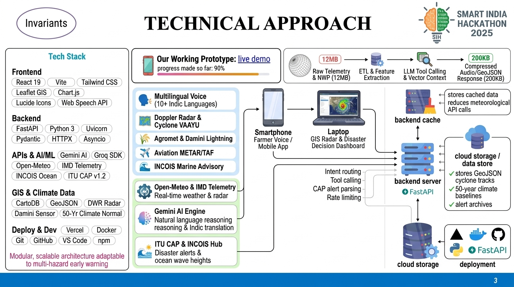

# WeatherGPT — AI Weather Intelligence

  
  
  

  <strong>Conversational Weather • Forecast Intelligence • Disaster Awareness • GIS • 3D Earth</strong> 
  Smart India Hackathon 2026

  <a href="https://weathergpt-muchakarla.vercel.app/"><strong>LIVE DEMO</strong></a> ·
  <a href="https://github.com/hemanthhemanth1834-bit/WeatherGPT">SOURCE</a> ·
  <a href="docs/SIH_DEMO.md">4-MINUTE DEMO</a> ·
  <a href="docs/ARCHITECTURE.md">ARCHITECTURE</a> ·
  <a href="docs/DATA_SOURCES.md">DATA SOURCES</a>

> **WeatherGPT turns weather and hazard data into understandable, location-aware intelligence.**
>
> Ask naturally → retrieve verified data → compare models → explain clearly → show the evidence.

---

## 01 — Product Overview

WeatherGPT is an AI-assisted weather intelligence platform built for India. It combines public weather models, Earth-observation sources, disaster feeds, GIS, multilingual conversation, agricultural guidance, aviation/marine information, deterministic risk logic, voice interaction and an animated 3D Earth.

### Capability map

| Domain | Capability | Source / method |
|---|---|---|
| Weather | Current, hourly and daily forecasts | Open-Meteo |
| NWP | Auto, GFS, ECMWF IFS, DWD ICON | Open-Meteo |
| Air quality | AQI + pollutants | Open-Meteo |
| Marine | Coastal/marine variables | Open-Meteo |
| Radar | Recent precipitation radar | RainViewer |
| Satellite | Earth observation | NASA GIBS |
| Earthquakes | Recent seismic events | USGS |
| Natural events | Fire/hazard events | NASA EONET |
| Disasters | Global event feed | GDACS |
| Aviation | METAR / TAF | NOAA Aviation Weather |
| India warnings | District nowcast | IMD RSS |
| GIS | Maps + event layers | Leaflet + OpenStreetMap |
| 3D | Interactive Earth | Three.js |
| Agriculture | Crop/weather rules | Deterministic logic |
| Climate | Historical/reference analytics | Archive/reference data |
| Voice | Browser STT/TTS | Web Speech APIs |
| Local AI | Optional local model | Ollama |
| Realtime | Optional MQTT/WIS2 | Mosquitto |

Open-Meteo currently documents a free weather API and 30+ models, including ECMWF, NOAA and DWD model families. citeturn0search7turn0search6

---

## 02 — Live Product

### Live application

**https://weathergpt-muchakarla.vercel.app/**

The existing deployment is provided for demonstration access. **This README rewrite does not trigger a new Vercel deployment.**

### Example: natural-language weather

> “What is the weather in Vijayawada tomorrow?”

WeatherGPT can resolve the location and return:

- temperature
- feels-like temperature
- precipitation probability
- rainfall
- humidity
- wind
- pressure
- cloud cover
- UV
- forecast timeline
- source
- timestamp
- provenance state

### Example: NWP comparison

> “Compare GFS, ECMWF and ICON for Pune.”

The system retrieves model-specific values and exposes the spread/disagreement instead of hiding it.

---

## 03 — Live Visual Evidence

Where a provider exposes a direct image endpoint, this README uses provider-rendered imagery. Data-only providers are represented by live application panels and source links rather than fabricated screenshots.

### NASA GIBS — Earth observation

NASA GIBS provides global satellite imagery through public WMTS/WMS services. citeturn0search1turn1search4

**Source:** https://gibs.earthdata.nasa.gov/

### RainViewer — radar

RainViewer documents recent radar imagery through its public Weather Maps API, including recent frames at approximately 10-minute intervals. Its 2026 free offering retains past radar imagery for personal/educational use. citeturn1search1turn0search10

**Live metadata:** https://api.rainviewer.com/public/weather-maps.json

> Provider image URLs can rotate as upstream data changes. WeatherGPT requests current metadata at runtime instead of treating a permanent screenshot as live.

### Live source badges

  
  
  
  
  
  

---

## 04 — High-Level Architecture

<pre>
User
  ↓
Language + Intent + Location
  ↓
Deterministic Weather / Disaster Tools
  ↓
Public providers
  ├─ Open-Meteo
  ├─ RainViewer
  ├─ NASA GIBS
  ├─ USGS
  ├─ NASA EONET
  ├─ GDACS
  ├─ NOAA Aviation Weather
  ├─ OpenStreetMap
  └─ IMD RSS
  ↓
Validation + timestamp + provenance
  ↓
WeatherGPT explanation
  ↓
2D GIS + 3D Earth + Live Evidence
</pre>

### Technology

**Frontend:** React 19, Vite, Tailwind CSS, Leaflet, Three.js, React Markdown, Lucide.

**Backend:** Python, FastAPI, Uvicorn, Pydantic, HTTP clients, Pytest.

**Optional infrastructure:** PostgreSQL/PostGIS, Valkey, Mosquitto/MQTT, Ollama, WRF/GRIB2/NetCDF.

---

## 05 — Weather & Forecast Intelligence

### Current conditions

- temperature
- apparent temperature
- humidity
- precipitation
- pressure
- cloud cover
- wind speed/direction
- visibility
- UV
- sunrise/sunset

### Forecast

- hourly forecast
- daily forecast
- precipitation probability
- rain/showers/snow
- wind/gusts
- cloud layers
- temperature trends

### Location intelligence

- city search
- geocoding
- GPS location
- reverse geocoding
- saved places
- city comparison

Open-Meteo supports free forecast/historical workflows and direct model selection. citeturn0search7turn0search4

---

## 06 — NWP Model Intelligence

| Model | Backend route | Role |
|---|---|---|
| Auto | <code>model=auto</code> | Best-match workflow |
| GFS | <code>model=gfs</code> | NOAA/NCEP global forecast |
| ECMWF | <code>model=ecmwf</code> | ECMWF IFS |
| ICON | <code>model=icon</code> | DWD ICON |

Open-Meteo documents GFS, ECMWF IFS and DWD ICON access and model-specific variables. citeturn0search4turn0search8turn0search11

### Model comparison

<pre>
Location
 ├── Auto
 ├── GFS
 ├── ECMWF IFS
 └── DWD ICON
       ↓
Temperature / Rain / Wind
       ↓
Spread + disagreement
       ↓
Explanation
</pre>

API: <code>GET /api/nwp/compare?location=Pune</code>

### WRF

A local WRF GRIB2/NetCDF adapter exists.

**WRF is not labelled LIVE until a real WRF output dataset is configured and readable.**

---

## 07 — Conversational AI Agent

<pre>
User question
     ↓
Language detection
     ↓
Intent detection
     ↓
Location extraction
     ↓
Tool selection
     ↓
Live / computed data
     ↓
Provenance + timestamp
     ↓
Plain-language answer
</pre>

Representative endpoints:

- <code>POST /api/chat/query</code>
- <code>POST /api/language/analyze</code>
- <code>GET /api/agent/tools</code>
- <code>GET /api/agent/engine</code>

Supported intent families:

**Weather · Forecast · Comparison · Alerts · Risk · Agriculture · Aviation · Marine · Climate · Location · Disaster**

> **Design rule:** the agent explains retrieved/computed information; it does not invent weather observations.

---

## 08 — Multilingual Assistant

WeatherGPT supports:

**English · Hindi · Telugu · Tamil · Marathi · Bengali · Gujarati · Punjabi · Kannada · Malayalam · Odia**

Example:

> “Vijayawada lo repu rain untunda?”

The language layer resolves language, intent and location before calling weather tools.

---

## 09 — Radar, Satellite & Earth Observation

### Radar

RainViewer supplies recent precipitation radar imagery through its public Weather Maps API. The documented API provides recent radar frames at 10-minute intervals over the recent two-hour window. citeturn0search0turn0search10

### Satellite

NASA GIBS provides global Earth-observation imagery through WMTS/WMS and related services. citeturn0search1turn1search0

### Provenance rule

A viewer URL, image tile, static asset and application-proxied dataset are **not equivalent**. WeatherGPT keeps these states separate.

---

## 10 — Disaster & Hazard Intelligence

### USGS earthquakes

USGS provides FDSN event queries and real-time GeoJSON feeds for earthquake applications. citeturn4search1turn4search6

### Natural events

NASA EONET is used for public natural-event information.

### Global disasters

GDACS is used as a disaster-event source.

### Weather hazard logic

WeatherGPT can compute application-level indicators for:

- heavy rainfall
- heat
- strong wind
- thunderstorms
- flood-related conditions
- cyclone-related conditions

**Computed risk and application alerts are not official emergency bulletins.**

---

## 11 — IMD Official Warning Layer

WeatherGPT includes a keyless IMD district-nowcast RSS integration.

The UI can expose:

- warning text
- affected area
- source
- timestamp
- official-source state

The official IMD API portal provides authorized access to observations, forecasts, warnings and bulletins. citeturn0search4

**Protected/authenticated IMD data is never claimed as available without authorization.**

---

## 12 — Agriculture Intelligence

Crop-oriented rule logic covers:

**Paddy · Cotton · Wheat · Sugarcane · Soybean · Mustard**

Example:

> “Can I plan paddy field work tomorrow?”

<pre>
Forecast
  ↓
Rain + wind + humidity + temperature
  ↓
Crop rules
  ↓
Advisory
  ↓
Evidence + uncertainty
</pre>

Agriculture output is informational and does not replace government or professional agronomic advice.

---

## 13 — Aviation Weather

WeatherGPT uses NOAA Aviation Weather information when the upstream service responds.

Typical products:

- METAR
- TAF
- aviation observations
- airport/station context

The current NOAA API documents worldwide METAR/TAF coverage and machine-readable formats such as JSON and GeoJSON. citeturn4search0

> Not a certified flight-planning system.

---

## 14 — Marine Intelligence

The marine layer provides model-based coastal information such as:

- wind
- wave-related variables
- sea-state interpretation
- coastal weather context
- fisherman-oriented guidance

Non-official/model-derived values are labelled **ESTIMATED** or **MODEL-DEPENDENT**.

---

## 15 — Climate Analytics

The climate module provides reference/analytical views for:

- historical temperature context
- anomalies
- monsoon analysis
- event trends
- reference periods
- explanatory charts

Reference datasets are explicitly labelled **STATIC** when they are not live monitoring feeds.

---

## 16 — GIS + 3D Earth

### 2D GIS

- Leaflet
- OpenStreetMap
- radar overlays
- earthquake markers
- natural-event markers
- warning zones
- location layers

### 3D Earth

- Three.js globe
- coastline data
- day/night terminator
- weather markers
- disaster markers
- animated transitions
- adaptive rendering
- lazy loading
- reduced-motion fallback

The 3D layer enhances the experience without becoming a requirement for the core weather workflow.

---

## 17 — High-Level UI/UX

WeatherGPT uses a **weather command-center** visual language.

### Visual design

- glass/telemetry cards
- source-first status chips
- compact metric panels
- animated weather states
- live evidence panels
- GIS overlays
- 3D Earth
- responsive navigation
- accessible contrast
- reduced-motion mode
- graceful loading/error states

### Motion design

Animation communicates:

- data refresh
- forecast transitions
- map events
- source freshness
- model comparison
- Earth interaction

The interface remains understandable when motion is reduced.

---

## 18 — Free-First Provider Matrix

| Capability | Free / alternative source | Status |
|---|---|---|
| Forecast | Open-Meteo | LIVE |
| GFS | Open-Meteo | LIVE |
| ECMWF IFS | Open-Meteo | LIVE |
| DWD ICON | Open-Meteo | LIVE |
| Air Quality | Open-Meteo | LIVE |
| Marine | Open-Meteo | LIVE |
| Historical / ERA5 | Open-Meteo | LIVE |
| Radar | RainViewer | LIVE |
| Satellite | NASA GIBS | LIVE/reference |
| Earthquakes | USGS | LIVE |
| Natural events | NASA EONET | LIVE |
| Global disasters | GDACS | LIVE |
| Aviation | NOAA Aviation Weather | LIVE when upstream responds |
| Maps | OpenStreetMap | LIVE |
| Reverse geocode | BigDataCloud | FREE/FAIR-USE |
| India warnings | IMD RSS | LIVE when upstream responds |
| Local AI | Ollama | OPTIONAL |
| MQTT/WIS2 | Mosquitto | OPTIONAL |
| Spatial DB | PostgreSQL/PostGIS | OPTIONAL |
| Cache | Valkey | OPTIONAL |
| Regional NWP | WRF | OPTIONAL |

**No paid API key is required for the core WeatherGPT workflow.**

---

## 19 — Optional Advanced Adapters

### WRF
Local GRIB2/NetCDF workflow.

### NOAA NOMADS
Free NOAA GRIB2 path for advanced model workflows.

### MQTT / WIS2
Optional self-hosted realtime architecture using Mosquitto.

### PostgreSQL / PostGIS
Optional spatial persistence and geospatial queries.

### Valkey
Optional Redis-compatible cache.

### Ollama
Optional local NLU/LLM.

These integrations remain **OPTIONAL / NOT CONFIGURED** until real runtime data is connected.

---

## 20 — Voice + Low Connectivity

### Voice

<pre>
Microphone
   ↓
Web Speech STT
   ↓
WeatherGPT agent
   ↓
Weather tools
   ↓
Response
   ↓
SpeechSynthesis / TTS
</pre>

Status: <code>GET /api/voice/status</code>

### Low connectivity

The architecture supports:

- fast initial rendering
- cached interface assets
- responsive/mobile layout
- reduced-motion fallback
- graceful provider failures
- PWA/service-worker architecture

Live weather still requires network access when upstream data is needed.

---

## 21 — Provenance & Trust

| Label | Meaning |
|---|---|
| **LIVE** | Retrieved from an upstream service |
| **OFFICIAL** | Directly attributed to an official source |
| **COMPUTED** | Derived from retrieved data + documented rules |
| **ESTIMATED** | Model/application-derived |
| **STATIC** | Reference/demo dataset |
| **DEMO** | Illustrative scenario/geometry |
| **SIMULATED** | Fallback simulation |
| **NOT CONFIGURED** | Adapter exists but real feed/runtime is absent |

> **An adapter existing in the repository does not make its output LIVE.**

This rule applies especially to WRF, MQTT/WIS2, PostGIS, Valkey and Ollama.

---

## 22 — Live Evidence + Capability APIs

- <code>GET /api/platform/capabilities</code>
- <code>GET /api/nwp/compare?location=Pune</code>
- <code>GET /api/providers/health?live=true</code>
- <code>GET /api/satellite/info</code>

The frontend exposes source/status information beside the visual evidence.

---

## 23 — API Surface

### Health
- <code>GET /api/health</code>
- <code>GET /api/providers/health</code>
- <code>GET /api/providers/health?live=true</code>

### Weather
- <code>GET /api/weather/current</code>
- <code>GET /api/air-quality</code>
- <code>GET /api/nwp/status</code>
- <code>GET /api/nwp/compare?location=Pune</code>

### Alerts / disasters
- <code>GET /api/imd/warnings</code>
- <code>GET /api/disasters/earthquakes</code>
- <code>GET /api/disasters/wildfires</code>

### Earth observation / climate
- <code>GET /api/satellite/info</code>
- <code>GET /api/climate/history</code>

### Agent / language
- <code>POST /api/chat/query</code>
- <code>POST /api/language/analyze</code>
- <code>GET /api/agent/tools</code>
- <code>GET /api/agent/engine</code>

### Platform / voice
- <code>GET /api/platform/capabilities</code>
- <code>GET /api/voice/status</code>

---

## 24 — Reliability

WeatherGPT is designed around imperfect upstream services.

- provider timeouts
- retries
- exponential backoff
- TTL caching
- health checks
- structured errors
- timestamps
- rate limiting
- explicit unavailable states
- labelled fallback behavior

<pre>
Provider available
      ↓
    LIVE

Provider unavailable
      ↓
Unavailable / labelled fallback

Never
      ↓
Silent fabricated "live" data
</pre>

---

## 25 — Security

- secrets excluded from Git
- environment variables for optional credentials
- explicit CORS
- request timeouts
- provider failure handling
- rate limiting
- structured API responses
- provenance metadata
- controlled fallback behavior

Never commit real API keys to source files, README, <code>.env.example</code>, screenshots or Git history.

---

## 26 — Repository Structure

<pre>
WeatherGPT/
├── backend/
│   ├── app/
│   │   ├── main.py
│   │   └── services/
│   └── tests/
├── frontend/
│   ├── public/
│   └── src/
│       ├── components/
│       ├── services/
│       └── styles/
├── docs/
├── infra/
│   ├── docker-compose.free.yml
│   └── mosquitto.conf
├── voice/
├── .env.example
└── README.md
</pre>

---

## 27 — Project Visuals

### SIH Technical Approach

### SIH Impact & Benefits

Project-specific presentation visuals are separated from live provider imagery.

---

## 28 — Local Development

### Backend

<pre>
cd backend
pip install -r requirements.txt
python -m uvicorn app.main:app --host 127.0.0.1 --port 8000 --reload
</pre>

API docs:

<code>http://127.0.0.1:8000/docs</code>

### Frontend

<pre>
cd frontend
npm install
npm run dev
</pre>

Frontend:

<code>http://localhost:5173</code>

### Optional free infrastructure

<pre>
docker compose -f infra/docker-compose.free.yml --profile data up
</pre>

Profiles:

**data · cache · realtime**

---

## 29 — Environment

Configuration template:

<code>.env.example</code>

Core weather functionality does not require paid credentials.

Optional settings cover WRF, MQTT, PostgreSQL, Valkey/Redis, Ollama and provider-specific credentials.

**Never commit <code>.env</code> or real secrets.**

---

## 30 — Testing & CI

The repository includes verification for:

- backend API behavior
- provider health
- frontend linting
- frontend builds
- browser smoke tests
- WebSocket behavior
- voice status
- weather routes
- disaster routes
- satellite metadata
- climate routes
- live provider smoke checks

Local:

<pre>
cd backend
python -m pytest -q

cd ../frontend
npm run build
npx oxlint src
</pre>

The live CI badge at the top reflects GitHub Actions workflow state.

---

## 31 — SIH Documentation

| Document | Purpose |
|---|---|
| <code>docs/ARCHITECTURE.md</code> | System architecture |
| <code>docs/DATA_SOURCES.md</code> | Provider inventory |
| <code>docs/AI_AGENT.md</code> | Agent/tool architecture |
| <code>docs/SECURITY.md</code> | Security model |
| <code>docs/PROVENANCE.md</code> | Source/licensing provenance |
| <code>docs/SIH_DEMO.md</code> | Judge/demo flow |
| <code>docs/SIH_MAPPING.md</code> | SIH requirement mapping |
| <code>docs/SIH_PRESENTATION.md</code> | Presentation package |
| <code>docs/SIH_PPT.md</code> | Presentation content |
| <code>docs/SIH_COMPLETE_IMPLEMENTATION.md</code> | Complete implementation map |
| <code>docs/SIH_QA.md</code> | Judge Q&A |

---

## 32 — Example User Journeys

### Citizen
> “Will it rain near Vijayawada tomorrow?”

Location → forecast → rain probability → time-window analysis → answer + source.

### Farmer
> “Can I plan paddy work tomorrow?”

Forecast → rain/wind/humidity → crop rules → advisory + uncertainty.

### Responder
> “Are there active hazards around India?”

IMD + GDACS + USGS + weather indicators → provenance-aware fusion → GIS.

### Technical user
> “Compare GFS, ECMWF and ICON for Pune.”

Model retrieval → spread → disagreement → explanation.

---

## 33 — What Is Intentionally Not Claimed

WeatherGPT does **not** claim:

- WRF is live without a real WRF dataset
- protected IMD APIs are available without authorization
- protected MOSDAC/ISRO datasets are directly integrated when they are not
- INCOIS official bulletins are integrated when they are not
- static climate references are live
- computed risk is an official warning
- application alerts are IMD bulletins
- marine estimates are official observations
- an adapter is LIVE merely because its code exists
- a paid LLM is required for the deterministic core

This keeps the SIH demonstration technically strong while preserving honest provenance.

---

## 34 — Attribution & License

WeatherGPT application code is independently implemented by **Muchakarla Hemanth Kumar**.

**License:** MIT — see <code>LICENSE</code>.

Third-party APIs, datasets, maps, packages and imagery remain subject to their respective licenses and usage policies.

See:

- <code>ATTRIBUTION.md</code>
- <code>THIRD_PARTY_NOTICES.md</code>
- <code>docs/PROVENANCE.md</code>

---

## 35 — Developer

**Muchakarla Hemanth Kumar**  
B.Tech CSE — AI/ML  
SRK Institute of Technology  
2024–2028

- GitHub: https://github.com/hemanthhemanth1834-bit
- LinkedIn: https://www.linkedin.com/in/hemanth-kumar-muchakarla-7974002a7/

---

  <strong>WeatherGPT</strong> 
  Understand the weather • Understand the risk • See the evidence

  Built for Smart India Hackathon 2026

